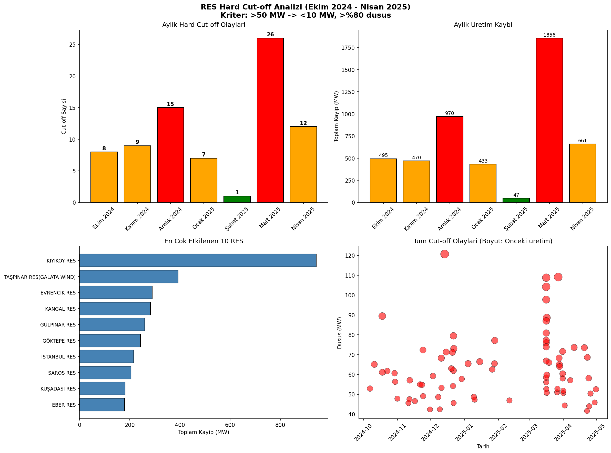
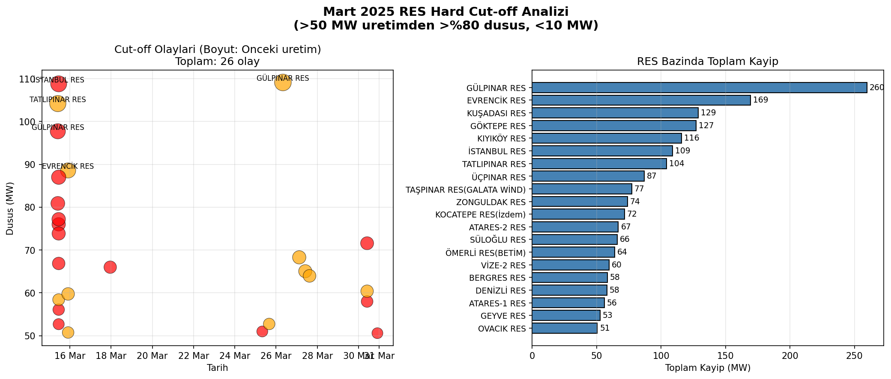
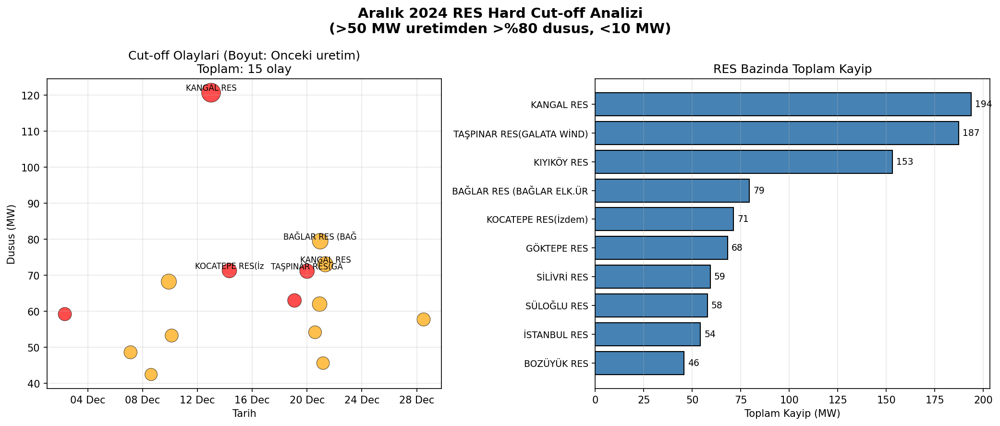
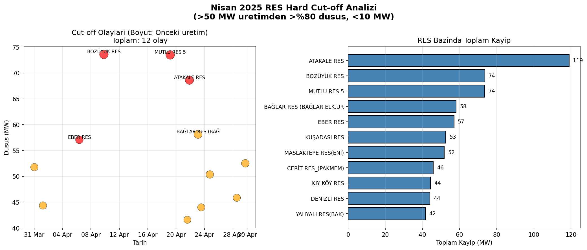
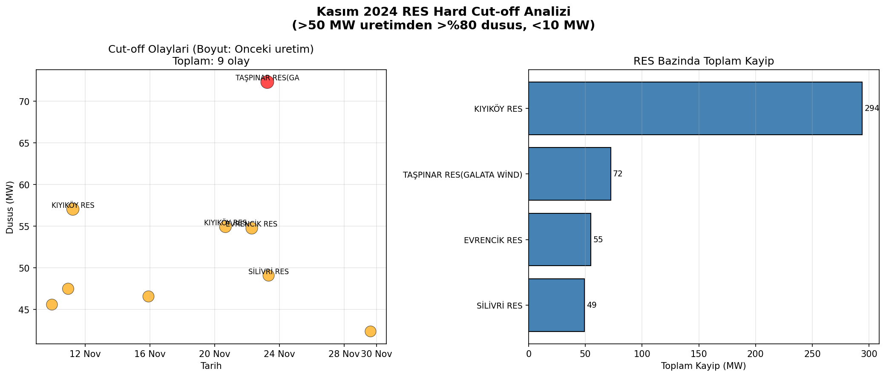
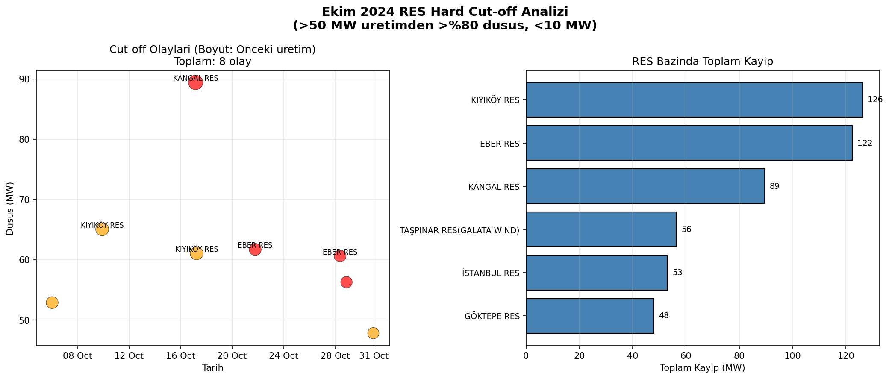
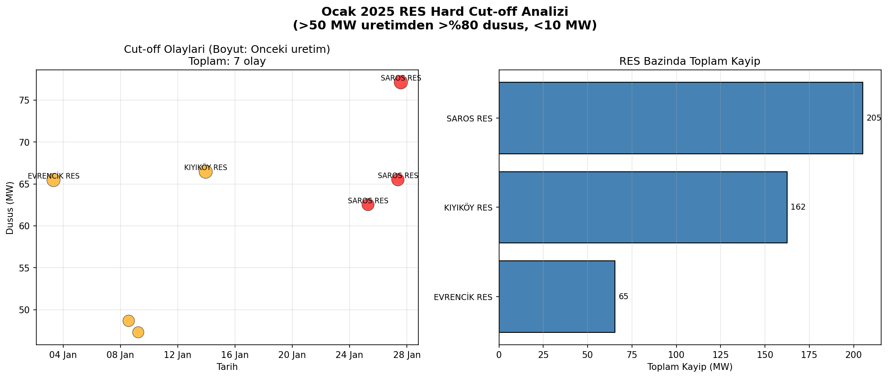
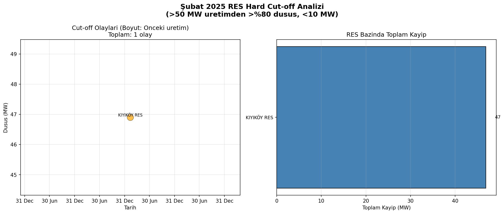

# 🌬️ Rüzgar Enerjisi Santrallerinde Hard Cut-off Analizi

## Türkiye Lisanslı RES'lerde Yüksek Rüzgar Hızı Kaynaklı Üretim Kesintileri

**Dönem:** Ekim 2024 - Nisan 2025 (7 Ay)  
**Veri Kaynağı:** EPİAŞ Şeffaflık Platformu  
**Analiz Tarihi:** Aralık 2025  
**Taranan Santral:** ~190 RES

---

## 1. Giriş

### Hard Cut-off Nedir?

Rüzgar türbinleri belirli bir rüzgar hızı aralığında çalışacak şekilde tasarlanmıştır:

- **Cut-in hızı:** ~3-4 m/s (türbin çalışmaya başlar)
- **Nominal hız:** ~12-15 m/s (maksimum verim)
- **Cut-out hızı:** ~23-25 m/s (türbin durur)

Rüzgar hızı **cut-out** hızını aştığında, türbin mekanik hasardan korunmak için otomatik olarak durur. Bu ani durma **"hard cut-off"** olarak adlandırılır ve üretimde ani düşüşe neden olur.

### Tespit Kriterleri

Bu analizde bir üretim düşüşünün "hard cut-off" olarak sınıflandırılması için:

| Kriter | Eşik Değer | Açıklama |
|--------|------------|----------|
| **Önceki Üretim** | > 50 MW | Santral yüksek kapasitede çalışıyor olmalı |
| **Sonraki Üretim** | < 10 MW | Neredeyse tamamen durmuş olmalı |
| **Düşüş Oranı** | > %80 | Ani ve keskin bir düşüş |

---

## 2. Genel İstatistikler

### Özet Tablo

| Metrik | Değer |
|--------|-------|
| **Toplam Hard Cut-off Olayı** | 78 |
| **Etkilenen RES Sayısı** | 30 |
| **Toplam Üretim Kaybı** | 4,931 MW |
| **Ortalama Kayıp/Olay** | 63.2 MW |
| **Maksimum Tekil Kayıp** | 121 MW |
| **Tamamen Durma (→0 MW)** | 42 olay (%54) |

---

## 3. Tüm Dönem Analizi



---

## 4. Aylık Dağılım

### Aylık Özet Tablo

| Ay | Cut-off Sayısı | Toplam Kayıp (MW) | Max Kayıp (MW) | Etkilenen RES |
|----|----------------|-------------------|----------------|---------------|
| **Ekim 2024** | 8 | 495 | 89 | 6 |
| **Kasım 2024** | 9 | 470 | 72 | 4 |
| **Aralık 2024** | 15 | 970 | 121 | 10 |
| **Ocak 2025** | 7 | 433 | 77 | 3 |
| **Şubat 2025** | 1 | 47 | 47 | 1 |
| **Mart 2025** | 26 | 1,856 | 109 | 20 |
| **Nisan 2025** | 12 | 661 | 74 | 11 |
| **TOPLAM** | **78** | **4,931** | - | **30** |

### Aylık Grafikler

#### Mart 2025 - En Fırtınalı Ay (26 Cut-off)


#### Aralık 2024 (15 Cut-off)


#### Nisan 2025 (12 Cut-off)


#### Kasım 2024 (9 Cut-off)


#### Ekim 2024 (8 Cut-off)


#### Ocak 2025 (7 Cut-off)


#### Şubat 2025 - En Sakin Ay (1 Cut-off)


---

## 5. En Çok Etkilenen Santraller

### Top 15 RES

| Sıra | Santral | Olay Sayısı | Toplam Kayıp (MW) | Max Kayıp (MW) |
|------|---------|-------------|-------------------|----------------|
| 1 | **KIYIKÖY RES** | 18 | 943 | 66 |
| 2 | TAŞPINAR RES (GALATA WİND) | 6 | 393 | 77 |
| 3 | EVRENCİK RES | 4 | 290 | 89 |
| 4 | KANGAL RES | 3 | 283 | 121 |
| 5 | GÜLPINAR RES | 3 | 260 | 109 |
| 6 | GÖKTEPE RES | 4 | 243 | 76 |
| 7 | İSTANBUL RES | 3 | 216 | 109 |
| 8 | SAROS RES | 3 | 205 | 77 |
| 9 | KUŞADASI RES | 3 | 181 | 68 |
| 10 | EBER RES | 3 | 179 | 62 |
| 11 | KOCATEPE RES | 2 | 143 | 72 |
| 12 | BAĞLAR RES | 2 | 138 | 79 |
| 13 | SÜLOĞLU RES | 2 | 124 | 66 |
| 14 | BOZÜYÜK RES | 2 | 119 | 74 |
| 15 | ATAKALE RES | 2 | 119 | 69 |

### Coğrafi Dağılım

- **Trakya Bölgesi** (Kıyıköy, Saros, Süloğlu, Vize): En yoğun etkilenen bölge
- **Marmara** (İstanbul, Taşpınar, Geyve): Önemli kayıplar
- **Ege** (Kuşadası, Gülpınar, Bergres): Orta düzey etki
- **İç Anadolu** (Kangal): En büyük tekil kayıp

---

## 6. Fırtına Günleri

Tek günde 3 veya daha fazla cut-off yaşanan günler:

| Tarih | Cut-off Sayısı | Toplam Kayıp (MW) | Etkilenen RES |
|-------|----------------|-------------------|---------------|
| **16 Mart 2025** | 15 | 1,098 | 15 |
| 21 Aralık 2024 | 4 | 289 | 4 |
| 31 Mart 2025 | 4 | 223 | 4 |
| 28 Mart 2025 | 3 | 182 | 3 |

### 🌪️ 16 Mart 2025 Fırtınası - Detay

**Tek günde 15 cut-off ile rekor!**

| Saat | Santral | Önceki → Sonraki | Kayıp |
|------|---------|------------------|-------|
| 10:00 | GÜLPINAR RES | 98 → 0 MW | 98 MW |
| 10:00 | EVRENCİK RES | 81 → 0 MW | 81 MW |
| 10:00 | TATLIPINAR RES | 111 → 7 MW | 104 MW |
| 11:00 | İSTANBUL RES | 109 → 0 MW | 109 MW |
| 11:00 | ÜÇPINAR RES | 87 → 0 MW | 87 MW |
| 11:00 | TAŞPINAR RES | 77 → 0 MW | 77 MW |
| 11:00 | GÖKTEPE RES | 76 → 0 MW | 76 MW |
| 11:00 | ZONGULDAK RES | 74 → 1 MW | 73 MW |
| 11:00 | ATARES-2 RES | 67 → 0 MW | 67 MW |
| 11:00 | BERGRES RES | 60 → 1 MW | 59 MW |
| 11:00 | ATARES-1 RES | 56 → 0 MW | 56 MW |
| 11:00 | GEYVE RES | 53 → 0 MW | 53 MW |
| 22:00 | EVRENCİK RES | 97 → 9 MW | 88 MW |
| 22:00 | VİZE-2 RES | 67 → 8 MW | 59 MW |
| 22:00 | KIYIKÖY RES | 57 → 6 MW | 51 MW |

**Toplam:** 1,098 MW kayıp tek günde

---

## 7. En Büyük 15 Cut-off Olayı

| Sıra | Tarih | Santral | Önceki | Sonraki | Kayıp |
|------|-------|---------|--------|---------|-------|
| 1 | 14 Aralık 2024 00:00 | **KANGAL RES** | 121 MW | 0 MW | **121 MW** |
| 2 | 27 Mart 2025 08:00 | GÜLPINAR RES | 118 MW | 9 MW | 109 MW |
| 3 | 16 Mart 2025 11:00 | İSTANBUL RES | 109 MW | 0 MW | 109 MW |
| 4 | 16 Mart 2025 10:00 | TATLIPINAR RES | 111 MW | 7 MW | 104 MW |
| 5 | 16 Mart 2025 10:00 | GÜLPINAR RES | 98 MW | 0 MW | 98 MW |
| 6 | 18 Ekim 2024 04:00 | KANGAL RES | 89 MW | 0 MW | 89 MW |
| 7 | 16 Mart 2025 22:00 | EVRENCİK RES | 97 MW | 9 MW | 88 MW |
| 8 | 16 Mart 2025 11:00 | ÜÇPINAR RES | 87 MW | 0 MW | 87 MW |
| 9 | 16 Mart 2025 10:00 | EVRENCİK RES | 81 MW | 0 MW | 81 MW |
| 10 | 21 Aralık 2024 23:00 | BAĞLAR RES | 83 MW | 3 MW | 79 MW |
| 11 | 16 Mart 2025 11:00 | TAŞPINAR RES | 77 MW | 0 MW | 77 MW |
| 12 | 26 Ocak 2025 07:00 | SAROS RES | 63 MW | 0 MW | 63 MW |
| 13 | 16 Mart 2025 11:00 | GÖKTEPE RES | 76 MW | 0 MW | 76 MW |
| 14 | 28 Ocak 2025 14:00 | SAROS RES | 77 MW | 0 MW | 77 MW |
| 15 | 10 Aralık 2024 22:00 | GÖKTEPE RES | 77 MW | 9 MW | 68 MW |

---

## 8. Özet ve Sonuçlar

```
╔══════════════════════════════════════════════════════════════════════╗
║                    📊 ANALİZ SONUÇLARI ÖZETİ                         ║
╠══════════════════════════════════════════════════════════════════════╣
║  DÖNEM: Ekim 2024 - Nisan 2025 (7 Ay)                                ║
║  KRİTER: >50 MW → <10 MW, >%80 düşüş                                  ║
╠══════════════════════════════════════════════════════════════════════╣
║  📌 GENEL                                                             ║
║     • Toplam Hard Cut-off: 78 olay                                    ║
║     • Toplam Üretim Kaybı: 4,931 MW                                   ║
║     • Etkilenen RES Sayısı: 30 santral                                ║
╠══════════════════════════════════════════════════════════════════════╣
║  📅 EN FIRTINALI AY                                                   ║
║     • Mart 2025: 26 cut-off, 1,856 MW kayıp                          ║
╠══════════════════════════════════════════════════════════════════════╣
║  🌪️ EN BÜYÜK FIRTINA GÜNÜ                                            ║
║     • 16 Mart 2025: 15 cut-off tek günde                              ║
╠══════════════════════════════════════════════════════════════════════╣
║  🏭 EN ÇOK ETKİLENEN RES                                              ║
║     • KIYIKÖY RES: 18 olay, 943 MW kayıp                             ║
╠══════════════════════════════════════════════════════════════════════╣
║  💥 EN BÜYÜK TEK OLAY                                                 ║
║     • KANGAL RES (14 Aralık 2024): 121 → 0 MW                        ║
╚══════════════════════════════════════════════════════════════════════╝
```

---

## 9. Bulgular ve Değerlendirme

### Temel Bulgular

1. **Mevsimsellik Belirgin**
   - Mart 2025 tek başına toplam kayıpların **%38'ini** oluşturuyor
   - Şubat en sakin ay (sadece 1 olay)
   - Kış sonu / ilkbahar başı fırtına sezonu

2. **Coğrafi Yoğunlaşma**
   - **Trakya bölgesi** açık ara en çok etkilenen bölge
   - KIYIKÖY RES toplam olayların **%23'ünü** yaşamış
   - Kuzey rüzgarlarına açık santraller daha savunmasız

3. **Fırtına Karakteristiği**
   - 16 Mart 2025 olağanüstü bir fırtına günü
   - Sabah 10-11 saatlerinde yoğunlaşma (fırtına zirve saati)
   - Geniş coğrafyada eş zamanlı etkiler

4. **Kayıp Profili**
   - Olayların **%54'ü** tamamen durma (→0 MW)
   - Ortalama kayıp 63 MW, maksimum 121 MW
   - Büyük kapasiteli santraller daha fazla etkileniyor

### Sınırlamalar

- ❌ Meteorolojik veri (rüzgar hızı) entegre edilmedi
- ❌ Sadece lisanslı YEKDEM santralleri analiz edildi
- ❌ Santral koordinatları olmadan detaylı bölgesel analiz yapılamadı
- ❌ Türbin tipi ve cut-out hızı bilgisi mevcut değil

### Öneriler ve Gelecek Çalışmalar

1. **Meteoroloji Entegrasyonu**
   - MGM veya Open-Meteo API'dan rüzgar hızı verisi çekme
   - Cut-off olaylarını rüzgar hızı ile korelasyon analizi

2. **Tahmin Modeli**
   - Makine öğrenmesi ile cut-off tahmini
   - Erken uyarı sistemi geliştirme

3. **Bölgesel Haritalama**
   - Santral koordinatları ile coğrafi görselleştirme
   - Fırtına yolu analizi

4. **Ekonomik Analiz**
   - Kayıp üretimin ekonomik değeri
   - Sigorta ve risk değerlendirmesi

---

## 10. Veri Kaynakları

- **EPİAŞ Şeffaflık Platformu:** https://seffaflik.epias.com.tr/
- **API Endpoint:** `/v1/renewables/data/licensed-realtime-generation`
- **Santral Listesi:** `/v1/renewables/data/licensed-powerplant-list`

---

*Bu rapor Aralık 2025 tarihinde EPİAŞ Şeffaflık Platformu açık verileri kullanılarak hazırlanmıştır.*

**Hazırlayan:** Faruk Avcı  
**İletişim:** avcio20@itu.edu.tr

